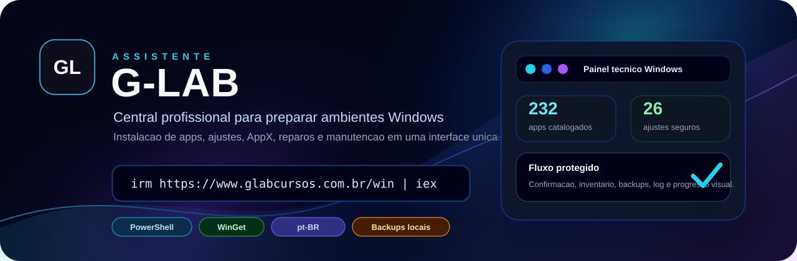
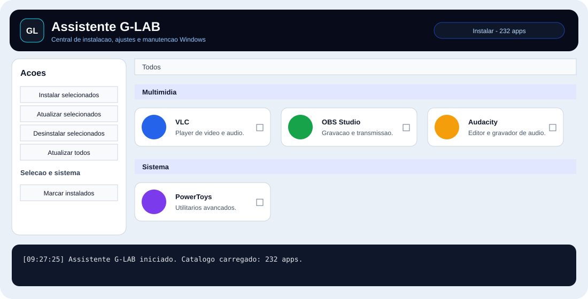
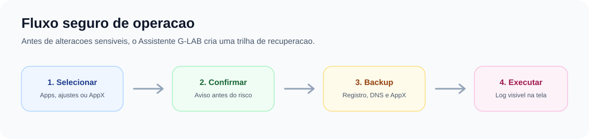

# Assistente G-LAB

<p align="center">
  
</p>

<p align="center">
  
  
  
  
</p>

<p align="center">
  <strong>Central grafica para preparar, ajustar e manter ambientes Windows com rapidez, padrao e seguranca operacional.</strong>
</p>

<p align="center">
  Versao atual: <code>0.3.0-dev</code>
</p>

<p align="center">
  <a href="#inicio-rapido">Inicio rapido</a> •
  <a href="#modulos">Modulos</a> •
  <a href="#seguranca-operacional">Seguranca</a> •
  <a href="#roadmap">Roadmap</a>
</p>

---

## Visao geral

O **Assistente G-LAB** e uma ferramenta Windows em PowerShell/WPF criada para acelerar rotinas de bancada, pos-formatacao, manutencao e padronizacao de maquinas.

O projeto reune instalacao de aplicativos, ajustes do Windows, remocao controlada de AppX, reparos, DNS, Windows Update e rotinas preventivas em uma interface unica, leve e em portugues.



## Inicio rapido

Execute no **Windows PowerShell**:

```powershell
irm https://www.glabcursos.com.br/win | iex
```

Fonte direta pelo GitHub:

```powershell
irm https://raw.githubusercontent.com/mrmatias-of/assistente-glab/main/web-bootstrap-template.ps1 | iex
```

## Preview



## Destaques

| Area | Recursos |
| --- | --- |
| Aplicativos | Catalogo com 232 apps, busca, categorias, presets, icones e selecao persistente |
| Atualizacoes | Verificacao de updates, atualizacao dos selecionados, atualizacao geral e reparo de fontes |
| Ajustes Windows | Checkboxes seletivos, verificacao de estado, ajustes seguros, registro controlado e reinicio do Explorer |
| AppX | Remocao controlada de apps provisionados, categorias, busca, preview, bloqueios e inventario antes da acao |
| Manutencao | DISM, SFC, reparo de rede, horario/NTP, limpeza de temporarios, relatorio de saude e ponto de restauracao |
| Operacao | Log integrado, progresso visual, confirmacoes e backups preventivos |

## Modulos

### Instalar

Catalogo de aplicativos organizado por categoria, com busca por nome, id, descricao e tags. A instalacao, atualizacao e remocao usam o instalador padrao do Windows, com suporte a pacotes WinGet e Microsoft Store.

### Ajustes

Ajustes do Windows em formato seletivo, inspirados no fluxo do WinUtil. Apenas itens marcados como seguros podem ser aplicados diretamente; itens planejados ou sensiveis permanecem bloqueados ate receberem tratamento dedicado.

### Configurar

Area de manutencao rapida para tarefas como ponto de restauracao, limpeza de temporarios, relatorio de saude, reparo do Windows, reparo de rede, horario/NTP, reinicio do Explorer e modos de Windows Update.

### Atualizar

Painel para verificar atualizacoes disponiveis, atualizar aplicativos selecionados, atualizar todos os aplicativos detectados e reparar as fontes usadas pelo instalador.

### AppX

Remocao controlada de aplicativos provisionados do Windows, com categorias, busca, selecao de itens seguros, confirmacao e inventario antes da remocao.

### Win11

Base inicial para rotinas de preparacao do Windows 11, com caminho planejado para ISO, pendrive, AutoUnattend, drivers e ajustes offline.

## Seguranca operacional



O Assistente G-LAB foi desenhado para evitar alteracoes sensiveis sem contexto. Procedimentos de maior impacto passam por confirmacao, log e backups locais quando aplicavel.

Medidas implementadas:

- confirmacao antes de acoes destrutivas;
- backup antes de ajustes de registro;
- backup da configuracao DNS antes de alteracoes;
- exportacao de politicas locais antes de mudar Windows Update;
- inventario AppX antes da remocao;
- tentativa de ponto de restauracao em ajustes e AppX quando executado como administrador;
- bloqueio contra acoes simultaneas;
- barra de progresso durante operacoes;
- log visivel na interface.

Os backups sao gravados em `backups/` dentro da copia local em execucao.

## Execucao local

```powershell
powershell -ExecutionPolicy Bypass -File .\Start-Assistente-GLAB.ps1
```

Execucao direta:

```powershell
powershell -ExecutionPolicy Bypass -File .\WinTool.ps1
```

Validacao sem abrir a interface:

```powershell
powershell -ExecutionPolicy Bypass -File .\WinTool.ps1 -ValidateOnly
```

## Estrutura

```text
.
├── WinTool.ps1
├── Start-Assistente-GLAB.ps1
├── bootstrap.ps1
├── web-bootstrap-template.ps1
├── config
│   ├── apps.json
│   ├── appx.json
│   ├── presets.json
│   └── tweaks.json
├── assets
│   ├── icons
│   └── readme
├── docs
├── functions
├── pester
├── scripts
├── src
└── xaml
```

## Catalogos

| Arquivo | Finalidade |
| --- | --- |
| `config/apps.json` | Aplicativos disponiveis para instalacao, atualizacao e remocao |
| `config/presets.json` | Conjuntos prontos de aplicativos para cenarios comuns |
| `config/tweaks.json` | Ajustes do Windows, comandos controlados e itens planejados |
| `config/appx.json` | Aplicativos AppX provisionados/removiveis |

## Icones

Os icones dos aplicativos sao armazenados localmente em `assets/icons`.

Para regenerar os assets:

```powershell
powershell -ExecutionPolicy Bypass -File .\src\New-IconAssets.ps1
```

## Roadmap

| Fase | Objetivo | Status |
| --- | --- | --- |
| Base confiavel | Instalacao, remocao, atualizacao, validacao e compatibilidade PowerShell 5.1 | Em andamento avancado |
| Ajustes Windows | Mais ajustes seguros, presets, deteccao de estado e desfazer | Em andamento |
| AppX | Preview de remocao, restauracao quando possivel e categorias refinadas | Em andamento |
| Reparos | Windows Update, rede, horario/NTP e relatorio de saude | Em andamento |
| Windows 11 Creator | ISO, USB, AutoUnattend, drivers e ajustes offline | Planejado |
| Arquitetura | Modularizacao, XAML separado, testes Pester e pipeline de release | Planejado |

## Desenvolvimento

Antes de publicar alteracoes:

```powershell
powershell -ExecutionPolicy Bypass -File .\WinTool.ps1 -ValidateOnly
```

Fluxo de publicacao:

```powershell
git add .
git commit -m "Descreva a mudanca"
git push
```

## Uso responsavel

O Assistente G-LAB executa rotinas administrativas capazes de alterar configuracoes do Windows. Para ambientes profissionais, recomenda-se validar presets e ajustes em laboratorio antes da distribuicao em larga escala.
